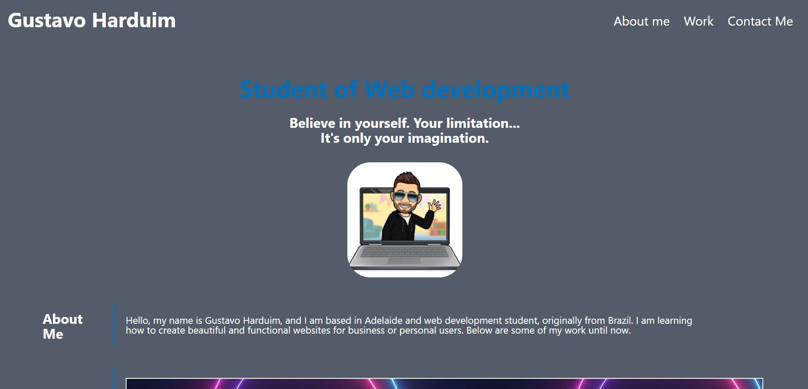
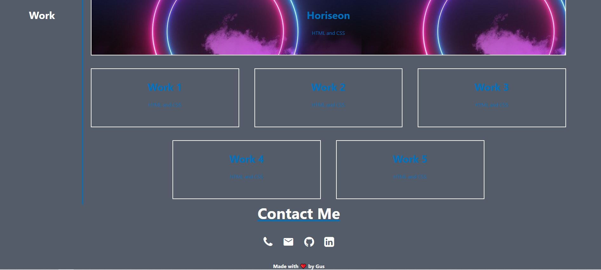

# Gus Portfolio

## Homework - week 2

## Short description

Create a portfolio will help me to make a personal self-assessment of my work, what I want to achieve with it and where to direct it going forward. By curating the selection and collection of my best work, I will identify my skills gained through various experiences and what my inspirations are, and organize them in a way that facilitates the understanding of their evolution.

The self-knowledge resulting from this process of creating my portfolio will help me answer questions more easily when going through interviews. The portfolio itself, when well constructed, serves to prove qualities such as organization, communication and skills related to the field of study I intend to study or the career I want to pursue.

## Table of Contents 

- [Screenshots](#screenshots)
- [HTML](#html)
- [CSS](#css)
- [Github](#github)

## Screenshots

## HTML

I have created a portfolio with my name, an avatar and links to sections about them in the navigation. 

I have created links to my past works and my contacts.

## CSS 

I have created css file and I tried keep the code as clean as possible.

## Github

1. I have created a new repository on your GitHub account and clone it to my computer.

2. I used the `git add`, `git commit`, and `git push` commands to save and push my code to my GitHub repository.

3. My repository is https://github.com/gharduim/Gus-portfolio

4. My live webpage is https://gharduim.github.io/Gus-portfolio/

